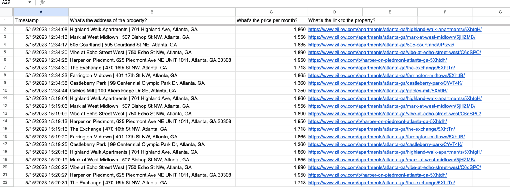

# LinkedIn Automation
This project is for more exploration of automation and web-scraping using selenium and bs4.


## Installation
1. Create a directory on your machine to house it. Something such as "ScrapingExercise" should work
```commandline
mkdir ScrapingExercise 
```
2. Look above and select "Code"
3. From here, copy HTTPS web URL
4. Return to your terminal and clone the repo.
```commandline
git clone https://github.com/LanoCodes/ATL-Renting-Research.git
```
5. Using your favorite IDE, open the ScrapingExercise folder.
6. Navigate to main and run the program from there. You will need to make sure to have the all the necessary packages instlled: you can see which by the imports at the top of main.

## Usage & Thoughts
- Some prerequisites:
  - You will have to create your own google form to point to.
- This project was an exercise for me to gain a deeper understanding of using BS4 and Selenium as far as I could push it without being unethical.
- In it, you'll notice custom headers and a set of rotating proxies that have afforded me the ability to scrape from the Zillow webpage I chose.
- However, Zillow still limits my code to around 9 listings. While I'm sure there's a workaround, I left it alone because I proved to myself that the task could be done and I learned along the way!
- At it's end, you'll find that the code grabs information from the zillow (which is something you can alter as well), and then uses it to auto-populate a Google form.
- That same Google form can be made into an Google spreadsheet in the form management UI, and I have provided the output below:
- 